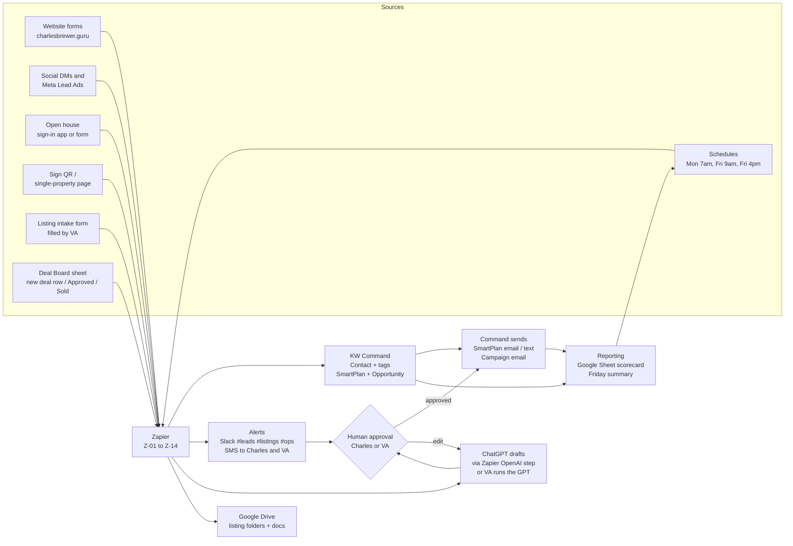

# 04 Automations: Map

Read `/00-START-HERE/conventions.md` first. Every tag, stage, SmartPlan, GPT name, and Zap name in this folder comes from that file.

## What this layer does

Zapier is the glue. It moves a lead from wherever it appeared (website form, social DM, open house sign-in, sign QR code) into KW Command with the right tags, the right SmartPlan, and an Opportunity in the right pipeline, then wakes up a human. It also moves listing data through the launch process, posts alerts, creates tasks, and pulls scorecard numbers.

Zapier never talks to a client. Command sends. ChatGPT drafts. A human approves.

## The human-in-the-loop rule

**ChatGPT drafts, a human approves, Command sends.**

Applied to automations, that means:

1. Automation may send exactly one thing to a lead without a human reading it: the instant acknowledgment in `SP-Speed to Lead` (Day 0 text and email). Everything else a client sees has been read by Charles or the VA first.
2. Every Zap that produces a client-facing draft ends in Slack (`#leads`, `#listings`, or `#ops`) or a Command task, not in a send.
3. Approval is a thumbs-up or an edited reply in the Slack thread. The VA then sends from Command. The SOPs in `09-VA-PLAYBOOK/sops/` name the specific message types the VA may approve alone.
4. Anything involving price, negotiation, legal terms, or bad news goes to Charles. No Zap, GPT, or SOP overrides this.

## Data flow



## All Zaps

| Zap | Trigger | Outcome | Priority |
|---|---|---|---|
| `Z-01 Website Form → Command Contact + Speed to Lead` | Form submitted on Sell / Buy / Invest page | Contact + type tag + `Src-Website` + `SP-Speed to Lead` + Opportunity in Cultivate + Slack/SMS alert | Build week 1 |
| `Z-02 New Command Contact → Lead Responder Draft` | New contact in Command (or new Slack `#leads` post) | `CB Lead Responder` JSON + SMS/email drafts posted to Slack for VA approval | Build week 1 |
| `Z-03 Meta Lead Ad / DM → Command + Speed to Lead` | New Meta Lead Ads lead (DMs via VA manual step) | Contact + `Src-Social` + `SP-Speed to Lead` + alert | Build week 1 |
| `Z-04 Open House Sign-in → Command + 8x8` | Command Open House app entry or Google Form response | Contact + `Src-OpenHouse` + `SP-8x8 New Contact` + same-day text draft | Build week 2 |
| `Z-05 Sign QR Inquiry → Command + Listing Link` | Single-property page form submitted | Contact + `Src-Sign` + note linking the listing Opportunity + alert | Build week 2 |
| `Z-06 Listing Intake Form → Drive Folder + Opportunity + Marketing Kit` | Listing intake form submitted by VA | Drive folder structure + Seller Opportunity (Listing Signed) + `CB Listing Marketer` kit as Google Doc + Slack approval + VA launch checklist | Build week 2 |
| `Z-07 Opportunity Stage Change → Social + SmartPlan + Seller Email` | Seller Opportunity moves to Coming Soon / Active / Under Contract / Closed | Scheduled social posts + correct SmartPlan started + milestone email draft | Build week 2 |
| `Z-08 Monday 7am → Weekly Seller Report Tasks` | Schedule, Monday 7:00am | One "Weekly Seller Report" task per Active seller Opportunity | Build week 1 |
| `Z-09 Closed Stage → Past Client Program` | Opportunity moves to Closed | `Past Client` tag, active tags removed, `SP-Past Client Program`, closing gift task, Day 7 review request, yearly anniversary reminder | Build week 2 |
| `Z-10 Friday 4pm → Scorecard Summary` | Schedule, Friday 4:00pm | Scorecard row read from Google Sheet, `CB Ops Manager` summary, email and Slack to Charles | Later |
| `Z-11 New Google Review → Thank-you + Social Task` | New review on Google Business Profile | Thank-you reply draft + share-to-social task + row in testimonials sheet | Later |
| `Z-12 New Deal on Deal Board → Deal Memo → Partner Match → Deal Alert` | New row on `Deal Board` sheet; then `Approved` checkbox flips | `CB Investor Analyst` Deal Memo in the deal folder, Slack approval to Charles, partner match against `Capital-Partner` profiles, Deal Alert via Command with 48-hour first look, Tier 1 call task | Later |
| `Z-13 Missed Call / Voicemail → Command Note + Ack + VA Task` | Missed call or voicemail in Google Voice or phone system | Command note, SMS acknowledgment, VA callback task | Later |
| `Z-14 Speed to Lead Escalation` | 5 minutes after new lead with no human response logged | Second SMS to Charles + VA call task | Build week 1 |
| `Z-15 Friday 9am → Project Update Tasks (Rehab Deals)` | Schedule, Friday 9:00am | One Project Update task per deal in Rehab; VA gathers budget/schedule/photos, `CB Investor Analyst` drafts the partner update, Charles approves, sent by 3pm | Later |
| `Z-16 Deal Sold → Profit Distribution + Partner Review + Next Deal Call + Repeat` | Deal Board status = Sold (or Investor Opportunity stage Sold) | Distribution statement draft (Charles and accountant verify), partner closing email + review request, next-deal call task, partner Opportunities to `Repeat` | Later |

## Build order and why

**Week 1** is the lead machine: Z-01, Z-02, Z-03, Z-14, and Z-08. These protect the 5-minute standard and the Monday seller report, which are the two non-negotiables that break first when volume rises.

**Week 2** is the listing machine: Z-04, Z-05, Z-06, Z-07, Z-09. These make every listing launch and close the same way every time.

**Later** is reporting, reviews, and the capital partner machine: Z-10, Z-11, Z-12, Z-13, Z-15, Z-16. Until built, the VA does these by hand using the SOPs. Build Z-12, Z-15, Z-16 as a set the week the first capital partner is onboarded.

## What stays manual on purpose

These are never automated, no matter how good the tools get:

- **Pricing.** CMA interpretation, list price recommendation, price reductions. Charles, in a conversation.
- **Offers.** Writing, presenting, and responding to offers. Charles, with the client on the phone.
- **Negotiations.** Repairs, credits, deadlines, terms. Charles.
- **Anything legal.** Contract interpretation, disclosures, agency questions, contingency removal advice. Charles, and the attorney or broker where required.
- **Bad news.** Low appraisal, failed inspection, buyer walked. A phone call from Charles, never a template.
- **First real reply to a lead.** Automation acknowledges. A human replies within 5 minutes.
- **Approval of any client-facing draft.** A human reads it. Every time.

## The capital partner model (investor side)

Charles sources fix-and-flip deals; capital partners fund them; Charles project-manages the rehab white glove and lists the finished flip. That changes three things in this folder:

- Investor pipeline stages: `Cultivate → Criteria Call → Partner Onboarded → Deal Presented → Deal Committed → Acquisition Under Contract → Rehab → Listed → Sold → Repeat`. The partner is the Opportunity; the deal lives on the `Deal Board` Google Sheet (Address, Source, Asking, ARV, Rehab Est, MAO, Status).
- Tag `Capital-Partner` (with Tier 1/2/3 and deal range on the `Capital Partners` sheet) replaces `Investor-Deal-Alerts` as the audience. `SP-Investor Deal Alerts` is renamed `SP-Capital Partner Program` and is a nurture plan, not a deal feed. Update `00-START-HERE/conventions.md` to match.
- Deal communication is Zap-driven: Z-12 (memo, match, alert), Z-15 (Friday project updates), Z-16 (sold, distribution, repeat). Every number a partner sees is verified by Charles first.

## Integration honesty

KW Command has a Zapier integration, but the exact triggers and actions available change and vary by account. Every Zap spec in `zaps/` names the ideal Command step and then a fallback:

1. **Email parser fallback.** Zapier Email Parser or Command's "add contact via email" address (verify this is enabled in your Command account) so a lead still lands in Command.
2. **CSV fallback.** Zapier writes rows to a Google Sheet; VA imports to Command daily.
3. **VA manual fallback.** Zapier posts the full payload to Slack; VA enters it in Command using `SOP-01`.

Never assume a specific Command API endpoint exists. Verify in your Command Zapier connection before building, and note what you found in the Zap's description field.

## Files in this folder

| File | Use it when |
|---|---|
| `zaps/Z-01-...` through `zaps/Z-16-...` | Building or debugging a specific Zap. Each has trigger, steps, field mapping, filters, ChatGPT prompt, alert template, error handling, test checklist, build time. |
| `command-smartplans/SP-*.md` | Building a SmartPlan in Command. Each has entry trigger, exit conditions, and the full step table with copy. |

## Shared alert format

All Slack alerts use one shape so the VA can read them at a glance:

```
:rotating_light: NEW [TYPE] LEAD  |  [Source]  |  [A/B/C or "untriaged"]
Name: [First Last]
Phone: [Phone]  |  Email: [Email]
Page/Property: [Page or Address]
Message: "[Message]"
Command: [Contact link]
Clock started: [Timestamp]. Human reply due by [Timestamp + 5 min].
```
